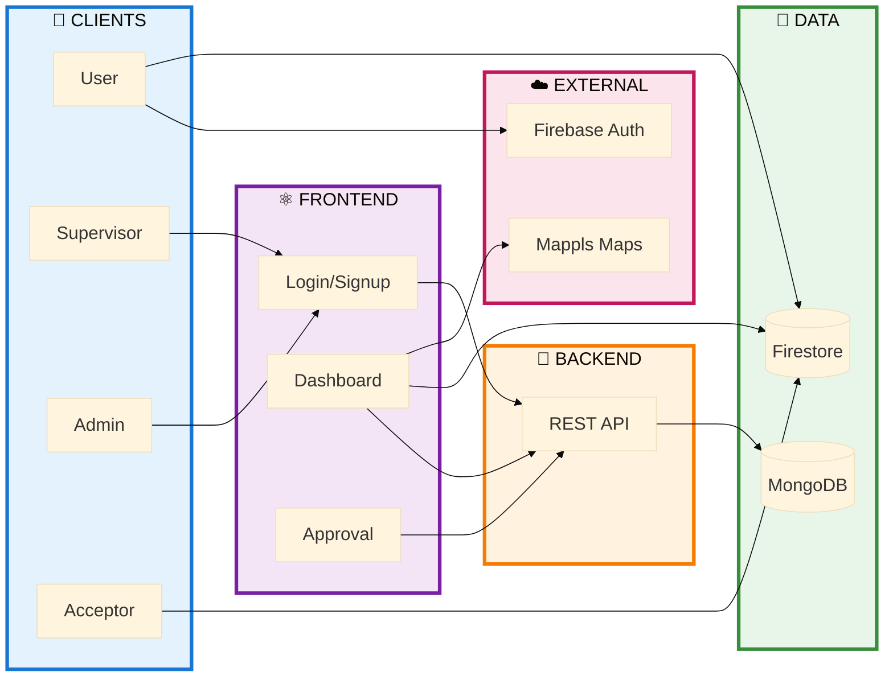
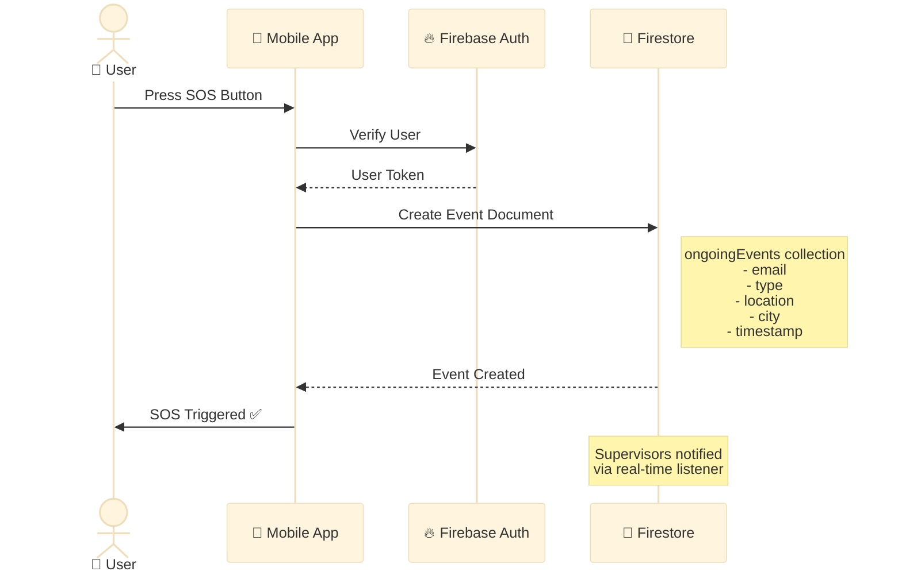
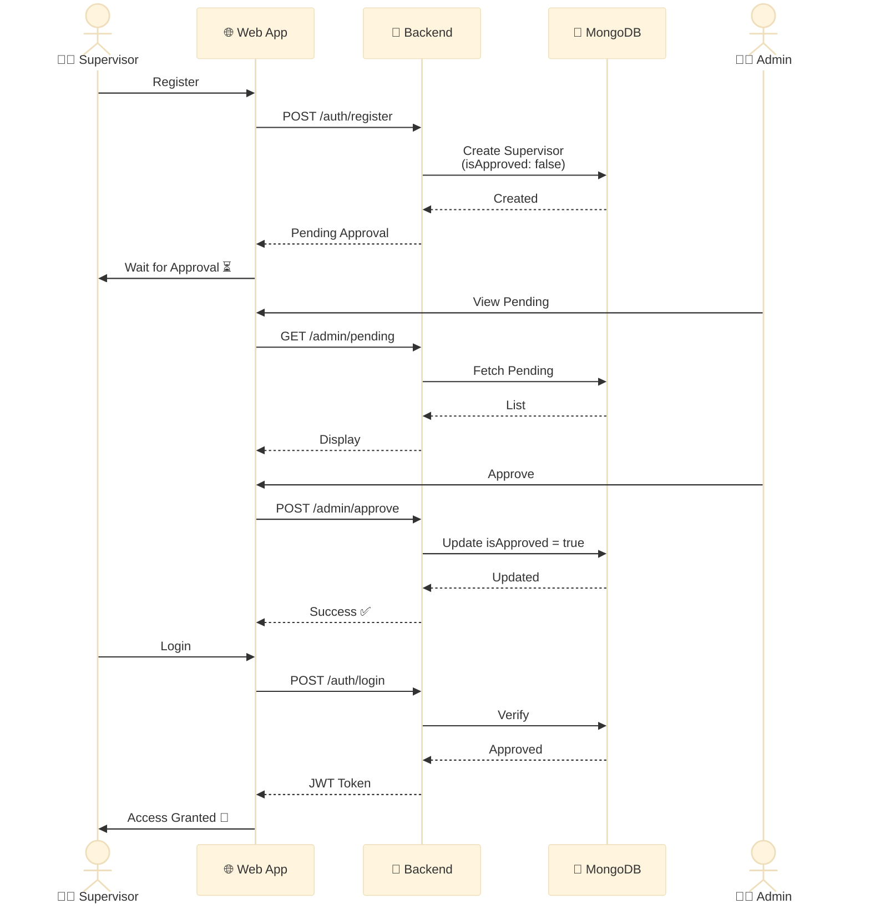
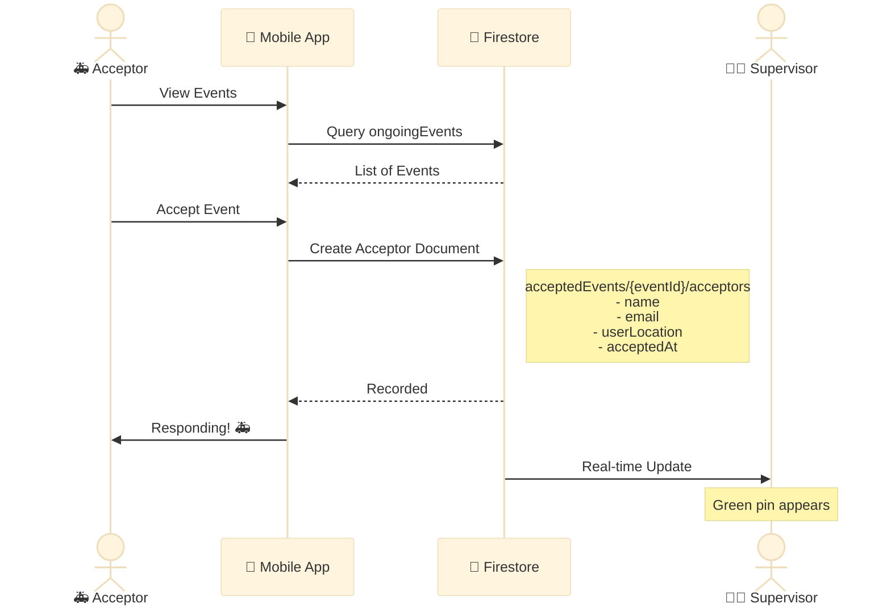
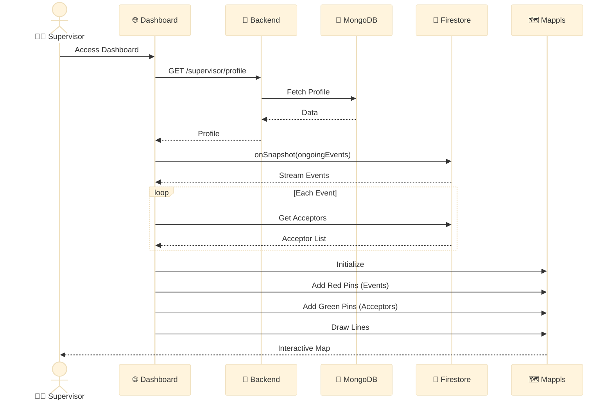
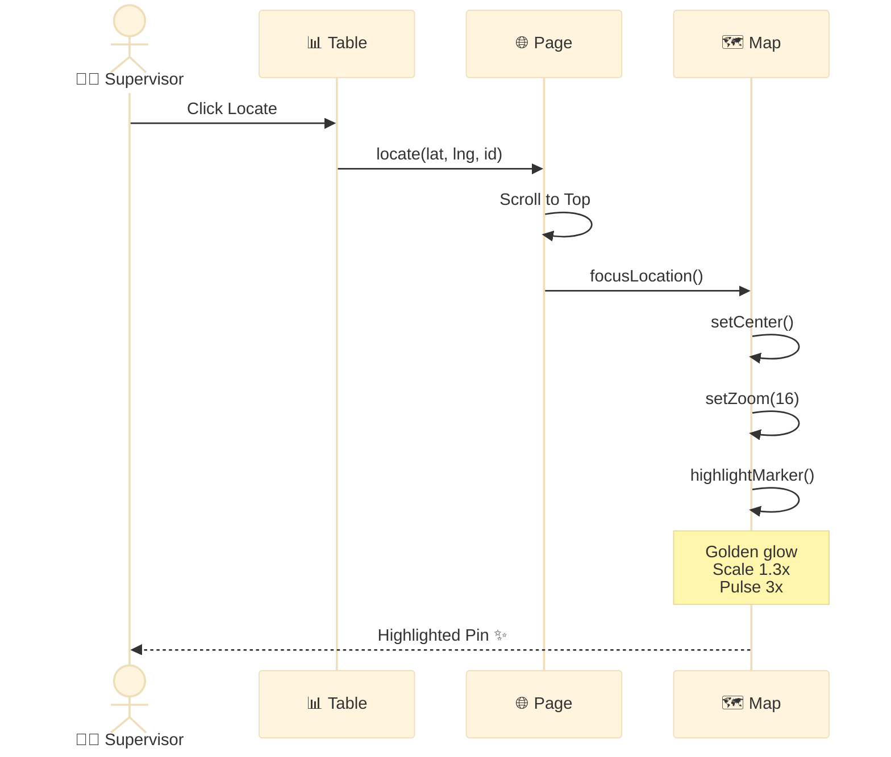
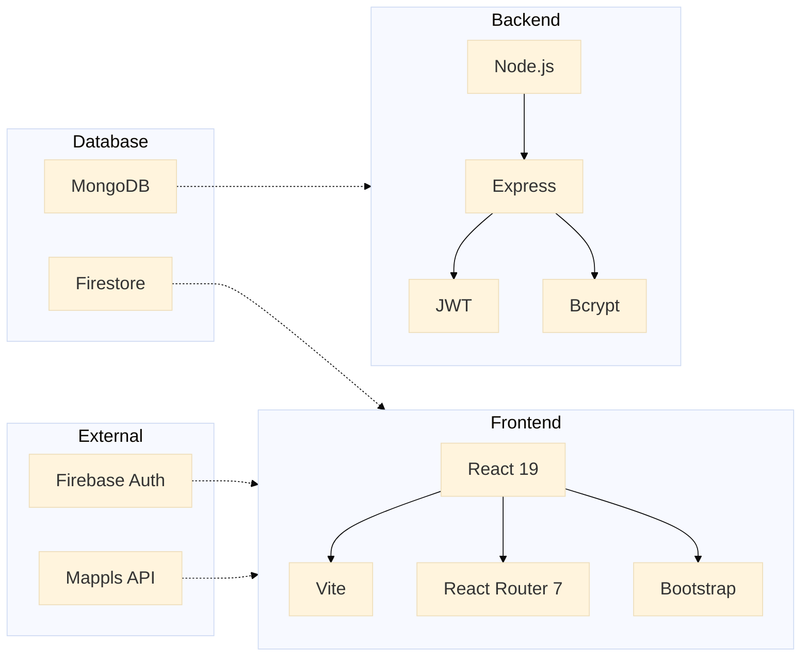
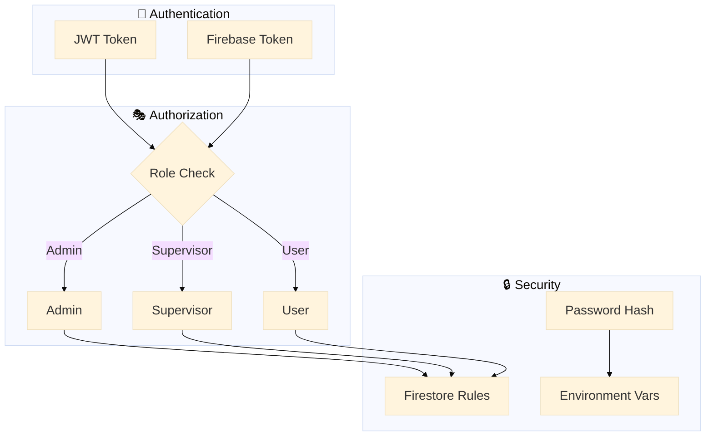
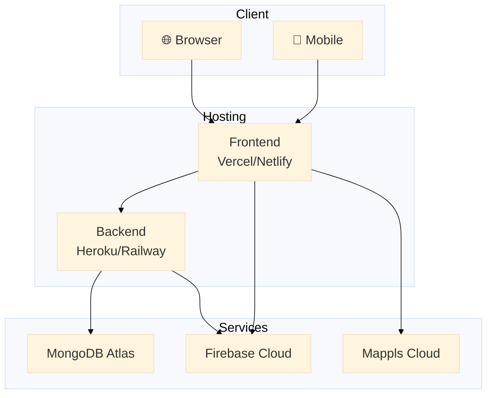

# WANA System Architecture

## How to View These Diagrams
- **GitHub/GitLab**: Push this file and view it directly (automatic Mermaid rendering)
- **VS Code**: Install "Markdown Preview Mermaid Support" extension
- **Online**: Copy diagram code to https://mermaid.live

---

## 1. Complete System Architecture

---

## 2. SOS Event Creation Flow

---

## 3. Supervisor Registration & Approval

---

## 4. Event Acceptance Flow

---

## 5. Dashboard Real-time Updates

---

## 6. Locate Button Flow

---

## 7. Technology Stack

---

## 8. Security Architecture

---

## 9. Deployment Architecture

---

## Key Features

### Real-time Capabilities
✅ Live event updates using Firestore onSnapshot  
✅ Automatic acceptor tracking  
✅ Real-time map pin updates  
✅ Distance calculation between events and acceptors  

### Security Features
✅ JWT-based authentication  
✅ Role-based access control (Admin, Supervisor)  
✅ Firebase authentication for users  
✅ Firestore security rules  
✅ Password hashing with bcrypt  

### Map Features
✅ Interactive Mappls map integration  
✅ Red pins for SOS events  
✅ Green pins for acceptors  
✅ Distance lines between events and acceptors  
✅ Pin highlighting with glow effect  
✅ Auto-scroll to map on locate  

### Responsive Design
✅ Mobile-first approach  
✅ Tablet optimization  
✅ Desktop layouts  
✅ Touch-friendly buttons (44px min height)  
✅ Horizontal scrolling tables on mobile  

---

**Generated:** February 2026  
**Project:** WANA - Women Safety Emergency Response System -->

